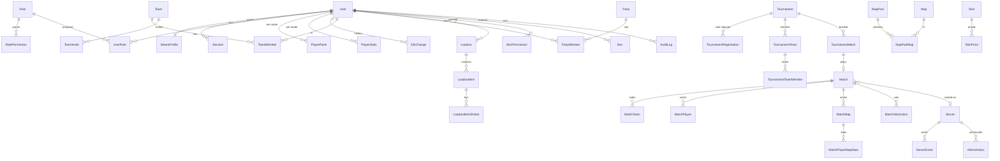
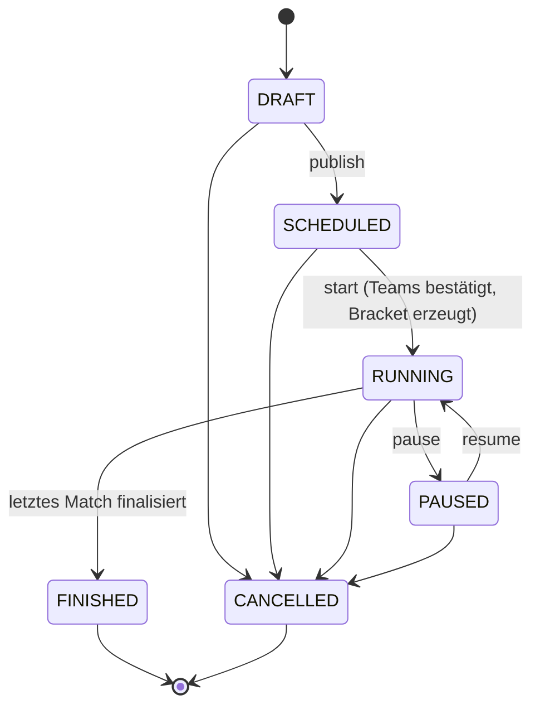
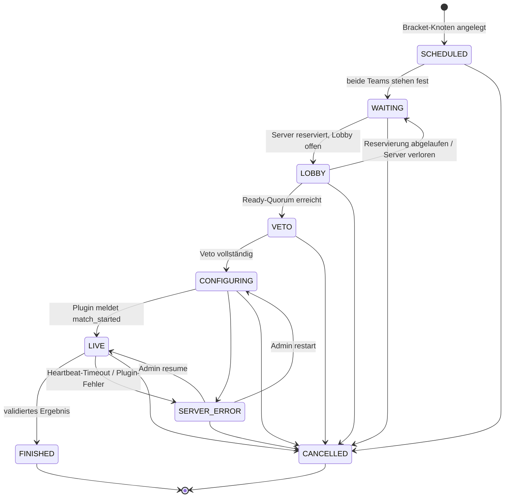
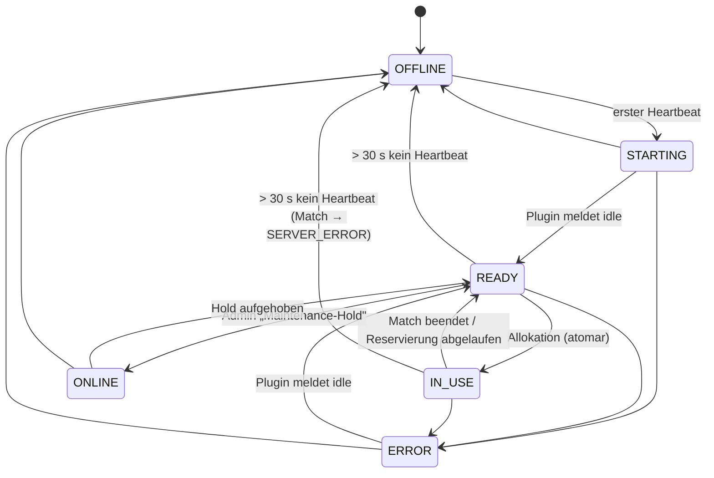
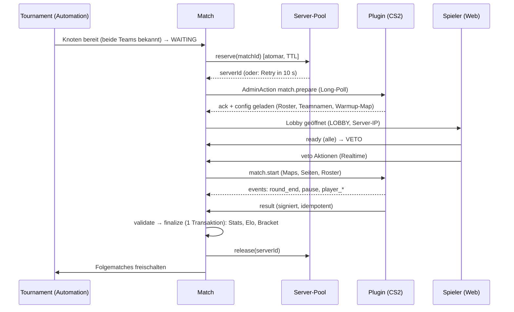

# Celtist Tournament Platform – Architektur

Stand: 02.10.2026 · Status: Planungsdokument, Quelle der Wahrheit für alle Phasen.
Technische Details stehen zusätzlich in [DATABASE.md](DATABASE.md), [TOURNAMENTS.md](TOURNAMENTS.md),
[PLUGIN.md](PLUGIN.md), [SKIN_SYSTEM.md](SKIN_SYSTEM.md), [SECURITY.md](SECURITY.md) und [DEPLOYMENT.md](DEPLOYMENT.md).

---

## 1. Ziel und Abgrenzung

Eine selbst gehostete Plattform für organisierte CS2-Turniere (5v5 und Wingman 2v2) mit Steam-Login,
Elo-Ranking, Brackets, Map-Veto, automatischer Server-Zuweisung, Match-Statistiken, Admin-Panel und
einem CS2-Server-Plugin (Metamod + CounterStrikeSharp).

Nicht-Ziele (bewusst): Steam-Inventar-Manipulation, Anti-Cheat, öffentliches Matchmaking in Valve-Größenordnung,
Zahlungen, Mehrsprachigkeit (UI ist Englisch, Doku Deutsch).

## 2. Ergebnis der Anforderungsanalyse

| Bereich | Kernaussage | Konsequenz für die Architektur |
|---|---|---|
| Vertrauen | Der Game-Server ist die einzige Quelle für Ergebnisse, aber nur authentifiziert und nur für „sein" Match | HMAC-signierte Server-API, Match-/Server-Bindung, Idempotenz |
| Konsistenz | Elo darf nie doppelt berechnet werden | Finalisierung als einzelne DB-Transaktion mit Statusübergang + Unique-Constraints |
| Parallelität | Ein Server darf nie zwei Matches hosten | atomare Reservierung per `FOR UPDATE SKIP LOCKED` + Unique-Index |
| Erweiterbarkeit | Mehrere Server, weitere Turnierformate | Server-Pool-Abstraktion, `BracketGenerator`-Strategie |
| Realtime | Bracket, Veto, Ready, Serverstatus ohne Polling | Socket.IO-Gateway + Redis-Adapter, Domain-Events |
| Fremdsysteme | Steam, Preis-APIs, Discord, CS2-Engine | Interfaces + Adapter, Fallbacks, Caching |
| Skin-Changer | Technisch instabil und von Valve nicht gewollt | eigenes, isoliertes Modul, standardmäßig **aus**, Fail-Safe (siehe §13) |

## 3. Stack-Entscheidungen (verifiziert am 02.10.2026)

Die Versionen wurden gegen die npm-Registry geprüft; viele Majors sind neuer als verbreitete Tutorials.
Ein Referenzprojekt wurde gebaut, getestet und gelintet, bevor Konfigurationen übernommen wurden.

| Thema | Entscheidung | Alternativen / Begründung |
|---|---|---|
| Monorepo | **npm workspaces**, kein Turborepo | pnpm ist nicht installiert; npm 11 reicht. Weniger Werkzeuge = weniger Fehlerquellen. |
| Sprache | TypeScript **6.x**, `strict` | TS 7 (native Compiler) ist brandneu; Nest-/Next-/Prisma-Toolchains zielen auf 6.x. |
| Laufzeit | Node **24** (≥ 22.12 Pflicht) | Alle Pakete verlangen ≥ 20.19/22.12. |
| Backend | **NestJS 12**, ESM (`"type": "module"`, `nodenext`) | Fastify statt Express wäre schneller, aber Socket.IO/Throttling-Ökosystem ist auf Express am besten erprobt; Last ist nicht der Engpass. |
| Validierung | **Zod 4** über NestJS-12-„Standard Schema" (`@Body({ schema })`) | class-validator: doppelte Typdefinitionen. Zod-Schemas liegen in `packages/shared` und werden **auch im Frontend** genutzt. |
| ORM | **Prisma 7** (`prisma-client`-Generator, `@prisma/adapter-pg`, `prisma.config.ts`) | Prisma 8 ist nur RC. Drizzle wäre leichter, Prisma ist von dir gefordert und liefert gute Migrations. |
| DB | PostgreSQL 17/18 | – |
| Cache/Queue | Redis 7 + **BullMQ 6** (`@nestjs/bullmq`) | – |
| Realtime | **Socket.IO** (`@nestjs/platform-socket.io`) + Redis-Adapter | SSE ist einfacher, kann aber nicht bidirektional (Veto, Ready). Raw `ws` hat kein Rooms/Reconnect. |
| Plugin → Backend | **HTTP + HMAC + Long-Poll** | WebSocket vom Plugin: mehr Reconnect-Code in C#. gRPC: unnötig schwer. Inbound-HTTP am Gameserver: zusätzliche Angriffsfläche. Outbound-only ist firewall-freundlich. |
| Auth | Eigene **Steam-OpenID-2.0**-Verifikation, serverseitige Sessions | `passport-steam`/`openid` sind unmaintained; die Verifikation ist ~100 Zeilen und sicherheitskritisch → selbst kontrollieren. JWT: nicht widerrufbar, hier unnötig. |
| Frontend | **Next.js 16** (App Router, RSC), React 19, Tailwind **4**, shadcn/ui | – |
| Client-Daten | RSC-Fetch für Erstladung, TanStack Query + Socket.IO für Live-Daten | – |
| Tests | **Vitest** (Nest-12-Default), `embedded-postgres` für DB-Integrationstests | Docker ist lokal nicht verfügbar; `embedded-postgres` braucht nur npm. |
| Lint/Format | ESLint (flat config) + typescript-eslint, Prettier | Nest 12 liefert oxlint; gewünscht war ESLint. |
| Plugin | C# **.NET 8**, CounterStrikeSharp.API 1.0.x | NuGet-Stand: 1.0.376 stabil, 2.0.0-alpha.1 ist Prerelease → nicht verwenden. |
| Reverse Proxy | **Caddy** (automatisches HTTPS) | Nginx + certbot als dokumentierte Alternative. |
| Skin-Katalog | `ByMykel/CSGO-API` (statische JSON) | Keine Hardcodierung, versionierbar, kein API-Key. |
| Skin-Preise | `SkinPriceProvider`-Interface, Standard-Adapter **Skinport** (`/v1/items`, 8 Req/5 Min, Brotli) | Steam-Market-Endpoint ist hart rate-limitiert. Adapter austauschbar; Fallback = letzter bekannter Preis. |

## 4. Systemkontext

```mermaid
flowchart LR
  subgraph Clients
    B[Browser]
    D[Discord]
  end
  subgraph Edge[Caddy – HTTPS]
    W[example.com]
    A[api.example.com]
    M[match.example.com]
    P[panel.example.com]
  end
  subgraph App
    WEB[Next.js web]
    API[NestJS api\nREST + Socket.IO\nserver gateway]
    JOBS[BullMQ workers\nim api-Prozess]
  end
  PG[(PostgreSQL)]
  RD[(Redis)]
  subgraph GameServers[CS2 Server 1..n]
    CSS[Metamod + CounterStrikeSharp\nCeltistTournament Plugin]
  end
  ST[Steam OpenID / Web API]
  PR[Skinport · CSGO-API]

  B --> W --> WEB --> API
  B --> A --> API
  B -. Socket.IO .-> A
  P --> WEB
  CSS -- HTTPS + HMAC --> M --> API
  API --> PG
  API --> RD
  JOBS --> PG
  JOBS --> RD
  API --> ST
  JOBS --> PR
  JOBS --> D
```

Entscheidungen dazu:

* **Ein API-Prozess, kein Microservice-Zoo.** Jobs laufen als Worker im selben Codebase (`WORKER_MODE`
  schaltet HTTP aus, falls später getrennt skaliert wird). `match.example.com` ist ein *eigener Hostname für
  dieselbe API* (nur Route-Präfix `/server/v1`), damit Game-Server per Firewall/Caddy getrennt von Nutzern
  behandelt und separat rate-limitiert werden können.
* **`panel.example.com`** ist optional: Caddy mappt auf `/admin` der Web-App. Berechtigungen werden
  ausschließlich im Backend geprüft, nie am Hostnamen.
* Cookies gelten für `.example.com` (Web und API sind „same-site"), siehe §11.

## 5. Repository-Struktur

```
celtist-platform/
├─ apps/
│  ├─ api/                  NestJS 12 (REST, Socket.IO, Server-Gateway, Jobs)
│  └─ web/                  Next.js 16 (öffentliche Seiten, Profil, Loadouts, Admin)
├─ packages/
│  ├─ shared/               Reine Domänenlogik + Zod-Schemas + Typen (kein Nest, kein DB-Zugriff)
│  │                        elo · rank · bracket · veto · permissions · share-code · float · skin-level · sign
│  ├─ database/             Prisma-Schema, Migrationen, Client-Fabrik, Seed
│  └─ config/               Gemeinsame tsconfig-/ESLint-Basis
├─ services/
│  └─ mock-cs2-server/      Simuliert das Plugin (Heartbeat, Befehle, Events, Ergebnis) für Entwicklung/E2E
├─ plugins/
│  └─ CeltistTournament/    C#-Projekt (CounterStrikeSharp)
├─ docs/  docker/  scripts/
```

Abweichung von der Vorgabe (`/types`, `/services/match-service`), bewusst:
`packages/types` ist in `packages/shared` aufgegangen (Typen entstehen aus den Zod-Schemas, ein Paket weniger).
Der „Match Service" ist kein eigener Prozess, sondern der Server-Gateway-Teil der API (siehe oben);
`services/` enthält stattdessen den Mock-Server, den du ausdrücklich für Tests ohne echten Server wolltest.

## 6. Backend-Module (NestJS)

Abhängigkeitsregel: Module hängen nur „nach unten" (Infrastruktur → Domäne → Orchestrierung). Zyklen werden
nicht mit `forwardRef` gelöst, sondern mit Domain-Events (`@nestjs/event-emitter`).

| Ebene | Modul | Verantwortung |
|---|---|---|
| Infrastruktur | `config`, `database` (PrismaService), `redis`, `logging` (pino, JSON), `common` (Guards, Filter, Pipes, Clock) | Env-Validierung, Verbindungen, Fehlerformat, Rate-Limit |
| Identität | `auth` | Steam OpenID, Sessions, CSRF |
| | `users`, `players` | Konto/Steam-Profil; öffentliche Spielerprofile, Stats-Abfragen |
| | `permissions` | Rollen, Permission-Auflösung, `@RequirePermission` |
| Domäne | `ranking`, `stats` | Elo-Anwendung, Rank-Stufen, Aggregation |
| | `maps` | Maps, Map-Pools, Veto-Templates |
| | `teams`, `parties` | Persistente Teams/Einladungen; Parties + Matchmaking-Queue |
| | `servers` | Server-Pool, Allokation, Heartbeat, Schlüssel |
| | `tournaments` | Turnier-CRUD, Anmeldung, Seeding, Bracket-Fortschritt |
| | `matches` | Match-State-Machine, Lobby/Ready, Veto, Finalisierung |
| | `skins`, `loadouts` | Katalog, Preise, Level, Loadouts, Share-Codes |
| Orchestrierung | `server-gateway` | Plugin-API (HMAC), Events/Resultat-Validierung |
| | `automation` | Verknüpft Turnier ↔ Match ↔ Server (Domain-Event-Handler) |
| | `realtime` | Socket.IO-Gateway, Räume, Autorisierung |
| | `notifications` | In-App + Discord-Webhooks |
| | `audit` | Unveränderliches Audit-Log |
| | `admin` | Dashboard, Spieler-/Skin-Verwaltung, Bans |
| | `jobs` | BullMQ-Prozessoren |

Muster: Controller (dünn) → Service (Use-Case, Transaktionen, Berechtigung) → Prisma. Eigene Repository-Klassen
nur dort, wo Abfragen komplex sind (Ranking, Bracket-Lesemodell). Reine Logik wohnt in `packages/shared` und wird
unabhängig von Nest getestet. Externe Dienste hinter Interfaces: `SteamApi`, `SkinPriceProvider`,
`SkinCatalogSource`, `WebhookSender`, `Clock`.

## 7. Datenmodell (Überblick – maßgeblich ist `packages/database/prisma/schema.prisma`)

IDs sind UUIDv7 (zeitlich sortierbar → gute Index-Lokalität). SteamID64 ist ein `String` (17 Zeichen, unique).



Wichtige Modellierungsentscheidungen:

* **`Match` = eine Serie** (BO1/3/5). Einzelne Maps: `MatchMap`. Elo wird **pro Serie** vergeben, Statistiken
  **pro Map** gespeichert (`MatchPlayerMapStats`) und in `MatchPlayer` zur Serie summiert.
* **`TournamentMatch` = Bracket-Knoten** (Runde, Position, Bracket-Seite, `winnerNext`/`loserNext` mit Slot) und 1:1 mit
  einem `Match`, das gleichzeitig mit dem Bracket angelegt wird (Status `SCHEDULED`).
* **Anmeldung**: Teams (Captain meldet ein `Team` an) *oder* Einzelspieler (`TournamentRegistration`), die
  Admins/Auto-Balance zu `TournamentTeam`s zusammenfügen. `TournamentTeamMember` ist ein **Roster-Snapshot**,
  spätere Teamänderungen verändern laufende Turniere nicht.
* **Zwei Elo-Spuren**: `PlayerRank`/`PlayerStats` je `(userId, mode)` mit `mode ∈ {FIVE_V_FIVE, WINGMAN}`.
* **Idempotenz auf DB-Ebene**: `EloChange @@unique([matchId, userId])`, `ServerEvent.idempotencyKey @unique`.
* **`AdminAction`** = an Server/Match gerichtete Befehle (pausieren, Map wechseln …) mit Lebenszyklus
  `PENDING → DELIVERED → ACKED | FAILED | EXPIRED`; **`AuditLog`** = Protokoll *aller* verändernden
  Admin-/Systemaktionen (wer, was, Ziel, alt, neu, Grund, IP). Jede `AdminAction` erzeugt zusätzlich einen Audit-Eintrag.
* **Preise**: `SkinPrice(skinId, wear, statTrak, priceUsd, source, fetchedAt)`; `Skin` hält zusätzlich
  denormalisiert `priceMaxUsd`/`priceUpdatedAt` für schnelle Listen. Level-Prüfung siehe [SKIN_SYSTEM.md](SKIN_SYSTEM.md).
* **Skin-Rechte**: `SkinPermission` ist ein Verlauf (Grants mit `expiresAt`, `revokedAt`, `supersededAt`).
  Wirksam ist der neueste nicht widerrufene, nicht abgelaufene Eintrag – **zur Lesezeit berechnet**; der Cron-Job
  räumt nur auf und löst Benachrichtigungen aus.
* **Rollen** sind Datenbankzeilen (`Role`, `RolePermission`, `UserRole`); Permission-Strings stammen aus einer typisierten
  Konstante in `packages/shared`, damit Tippfehler unmöglich sind.

## 8. API-Struktur (REST, Präfix `/v1`)

Fehlerformat überall: `{ "error": "MATCH_NOT_FOUND", "message": "…", "details"?: … }` – nie Stacktraces.
Listen: `?page&pageSize` (max 100) bzw. Cursor bei großen Verläufen. Vollständige Referenz: [API.md](API.md).

| Modul | Endpunkte (Auszug) | Auth |
|---|---|---|
| auth | `GET /auth/steam/login`, `GET /auth/steam/callback`, `POST /auth/logout`, `GET /auth/me`, `GET /auth/csrf`, `GET/DELETE /auth/sessions` | öffentlich / Session |
| players | `GET /players?q=`, `GET /players/:steamId`, `/stats?window=overall\|30d\|last`, `/matches`, `/tournaments` | öffentlich |
| ranking | `GET /ranking?scope=global\|30d\|tournament\|wingman&sort=elo\|wins\|winrate\|kd\|kills`, `GET /ranking/tiers` | öffentlich |
| tournaments | `GET /tournaments`, `GET /tournaments/:id`, `/bracket`, `/matches`, `POST /tournaments/:id/register`, Admin: `POST/PATCH/DELETE`, `start`, `pause`, `resume`, `cancel`, Team-/Spielerzuweisung | gemischt |
| teams | CRUD, Einladungen, Logo-Upload, Mitglieder | Session |
| parties | `POST /parties`, Einladen/Entfernen/Ready/Auflösen, `POST /parties/:id/queue` | Session |
| matches | `GET /matches`, `/matches/:id`, `/lobby`, `POST /matches/:id/ready`, `POST /matches/:id/veto`, Admin-Aktionen unter `/matches/:id/admin/*` | gemischt |
| maps | `GET /maps`, Admin: Maps, Map-Pools, Veto-Templates | öffentlich / Permission |
| servers | `GET /servers` (reduziert), Admin: CRUD, `rotate-key` | Permission `server.manage` |
| skins / loadouts | Katalog, Suche, Loadout-CRUD, Duplicate, Import per Code, Export, Share-Code erneuern | Session |
| admin | `/admin/dashboard`, `/admin/players`, `/admin/skin-permissions`, `/admin/bans`, `/admin/audit`, `/admin/roles`, `/admin/webhooks`, `/admin/settings` | Permission |
| server-gateway | `POST /server/v1/heartbeat`, `GET /server/v1/commands` (Long-Poll), `POST …/commands/:id/ack`, `POST /server/v1/events`, `POST /server/v1/matches/:id/result`, `GET /server/v1/matches/:id/config`, `POST /server/v1/players/authorize`, `GET /server/v1/loadouts/:steamId`, `POST /server/v1/skin-permissions` | HMAC (Server) |

Realtime (Socket.IO, Namespace `/realtime`, Cookie-Auth im Handshake, Räume per Autorisierung):
`match:{id}` → `match.updated`, `match.veto`, `match.ready`, `match.score`; `tournament:{id}` → `tournament.bracket`;
`live` → Live-Matches der Startseite; `servers` (nur `server.view`) → `server.status`; `party:{id}` → `party.updated`;
`user:{id}` → `notification`. Clients **abonnieren nur sichtbare Räume**, Server prüft jedes Join.

## 9. State Machines

### 9.1 Turnier



`registrationOpen` ist ein eigenes Flag (Anmeldung kann in `SCHEDULED` auf/zu gehen). `PAUSED` stoppt die
**Automation** (keine neuen Server-Zuweisungen, keine Match-Starts); laufende Matches spielen zu Ende.
`DRAFT`/`SCHEDULED` dürfen gelöscht werden, alles andere nur abgebrochen (Historie bleibt).

### 9.2 Match



* Anzeige-Status der Bracket-Karten (`Scheduled · Waiting · Ready · Live · Finished · Cancelled`) wird aus dem
  detaillierten Status **abgeleitet** (`LOBBY/VETO/CONFIGURING → Ready`, `SERVER_ERROR → Live (Warnung)`).
* **Pause** ist kein Zustand, sondern `pausedAt`/`pausedByTeam` am Match (Pause ändert den Lebenszyklus nicht).
* `FINISHED` hat ein `resultType`: `NORMAL`, `FORFEIT`, `ADMIN_DECISION`. **Elo nur bei `NORMAL`** (konfigurierbar
  für Forfeit). Bei `SERVER_ERROR` wird nie automatisch gewertet.
* Ein beendetes Match ist unveränderlich. Korrekturen laufen über „Match ungültig erklären" (Elo-Rückbuchung aus
  `EloChange`) – eine Bracket-Reparatur bereits gespielter Folgematches ist **nicht** Teil von v1 und wird abgelehnt.

### 9.3 Server



`ONLINE` bedeutet hier „erreichbar, aber für Allokation gesperrt" (Maintenance-Hold). Heartbeat alle 10 s;
> 30 s ohne Heartbeat ⇒ `OFFLINE` (Job `server-heartbeat-timeout`, plus Prüfung zur Lesezeit).

### 9.4 Map-Veto

Ein Veto-Template ist eine geordnete Liste `{ team: A|B, action: BAN|PICK|DECIDER }`. Standard-Templates (vom Admin
änderbar): BO1: 6 Bans → Decider · BO3: Ban, Ban, Pick, Pick, Ban, Ban → Decider · BO5: Ban, Ban, Pick, Pick, Pick, Pick → Decider.
Wer anfängt, wird einmal pro Match ausgelost (kryptografisch zufällig, serverseitig, gespeichert).
Nur der aktive Captain (bzw. bei Wingman ein beliebiger Spieler des aktiven Teams) darf handeln; Zeitlimit pro Schritt,
danach zufällige gültige Aktion (Auto-Veto-Job). Jede Aktion ist ein `MatchVetoAction` (Audit-fähig, idempotent per `stepIndex`).
Bei Pick bestimmt das gegnerische Team die Seitenwahl (Seite wird im Match gespeichert).

## 10. Match-Ablauf & Automation



Allokation (`servers/ServerAllocator`): eine SQL-Anweisung wählt `status = READY` **und** frischen Heartbeat mit
`FOR UPDATE SKIP LOCKED`, setzt `IN_USE`, `currentMatchId`, `reservedUntil`. Ein partieller Unique-Index auf
`currentMatchId` verhindert zwei Matches pro Server und zwei Server pro Match. Ohne freien Server bleibt das Match
`WAITING`; ein Job versucht es periodisch erneut (FIFO nach `scheduledAt`). Abbruch/Fehler gibt den Server frei.

Plugin-Join-Prüfung: Beim Verbinden fragt das Plugin (`players/authorize`, mit lokalem Cache aus der Match-Config)
„Ist diese SteamID für dieses Match auf diesem Server autorisiert und nicht gebannt?" – wenn nein: Kick mit Begründung.

Recovery: `SERVER_ERROR` ⇒ Admin kann `resume` (Server meldet laufendes Match zurück), `restart` (Map neu) oder `cancel`.
Es gibt **keine** automatische Elo-Berechnung ohne bestätigtes Ergebnis.

## 11. Security-Modell (Kurzform, Details in [SECURITY.md](SECURITY.md))

| Bedrohung | Gegenmaßnahme |
|---|---|
| Gefälschter Steam-Login | OpenID-Direktverifikation (`check_authentication` bei Steam), `claimed_id`-Format, `return_to`-Abgleich, Nonce-Replay-Schutz (Redis), `returnTo`-Whitelist |
| Session-Diebstahl | Opaker 256-Bit-Token, nur SHA-256-Hash in DB, `HttpOnly; Secure; SameSite=Lax`, Rotation beim Login, Widerruf, Idle-/Absolut-Timeout |
| CSRF | SameSite + Origin-Prüfung + pro Session abgeleitetes Token im Header `X-CSRF-Token` für alle nicht-sicheren Methoden |
| Brute Force/Missbrauch | Redis-Rate-Limits (global/IP, strenger für Auth, pro Server-ID, pro Nutzer für Schreibaktionen) |
| Gefälschtes Server-Ergebnis | HMAC-SHA256 über Methode, Pfad, Zeitstempel, Nonce, Body-Hash; ±30 s Zeitfenster; Nonce-Cache; pro-Server-Schlüssel (HKDF aus `SERVER_API_SECRET`, Version rotierbar); Ergebnis nur vom **zugewiesenen** Server |
| Manipulierte Stats | Plausibilitätsprüfung (Roster-Mitgliedschaft, Summen, Rundenanzahl, Zeitstempel, Match-Status), Idempotenz-Keys |
| Rechteausweitung | Granulare Permissions, serverseitig an jedem Endpunkt (`@RequirePermission`), Default deny, Audit-Log |
| Injection / XSS | Prisma (parametrisiert), Zod-Validierung an jeder Grenze, React-Escaping, CSP, kein `dangerouslySetInnerHTML` |
| Datei-Upload (Logos) | Magic-Byte-Prüfung (PNG/JPEG/WebP), ≤ 512 KB, Neu-Kodierung nicht nötig, Auslieferung mit `nosniff`, kein SVG |
| Secrets | Nur `.env`/Docker-Secrets, `.env.example` ohne Werte, Boot-Abbruch bei fehlenden/zu schwachen Secrets, Webhook-URLs AES-256-GCM-verschlüsselt (`ENCRYPTION_KEY`) |
| Info-Leaks | Einheitliche Fehler, Logging ohne Tokens/Cookies/Secrets (pino-Redaction) |

## 12. Berechtigungssystem

Permissions sind Strings der Form `<bereich>.<aktion>` (typisiert in `packages/shared/permissions`). Eine Rolle ist
eine Menge von Permissions; ein Nutzer kann mehrere Rollen haben; die effektive Menge ist die Vereinigung. `*` (nur Owner)
passt auf alles. Es gibt **kein** `isAdmin`.

Kern-Permissions: `admin.access`, `tournament.{create,edit,delete,start,manage,teams,bracket}`,
`match.{pause,resume,restart,forcemap,editscore,cancel,assignserver,forceteam,removeplayer}`,
`player.{ban,unban,pardon,elo.edit,rank.edit,view}`, `skin.{assign,level.1,level.2,level.3,catalog,prices}`,
`server.{view,manage,keys}`, `map.manage`, `team.edit.any`, `role.manage`, `settings.manage`, `audit.view`.

`skin.level.N` erlaubt, Level **bis N** zu vergeben (Level 3 impliziert 1 und 2); `skin.assign` erlaubt überhaupt Skin-Rechte zu setzen.

| Rolle | Standard-Permissions |
|---|---|
| Owner | `*` |
| Admin | alles außer `role.manage` |
| Moderator | `admin.access`, `player.{view,ban,unban,pardon}`, `match.{pause,resume,removeplayer}`, `skin.assign`, `skin.level.1`, `audit.view` |
| Tournament Admin | `admin.access`, `tournament.*`, `match.*`, `map.manage`, `team.edit.any`, `player.view` |
| Server Admin | `admin.access`, `server.*`, `match.{pause,resume,restart,assignserver}` |

Rollen sind im Admin-Panel editierbar (außer: letzte Owner-Rolle kann nicht entfernt werden). Systemrollen werden beim Seed angelegt.
In-Game-Admins werden **nicht** separat gepflegt: Das Plugin schickt die SteamID, das Backend löst sie auf Nutzer → Rollen → Permissions auf.

## 13. Skin-System – technische Realität (Kurzform)

Details und Quellen in [SKIN_SYSTEM.md](SKIN_SYSTEM.md).

1. Skins lassen sich in CS2 nur **serverseitig über Gamedata-Signaturen/Schema-Offsets** auf Entitäten anwenden. Diese brechen
   bei vielen CS2-Updates (zuletzt nach Build 1.41.6.9 / 1.41.8.x: bekannte Skin-Plugins funktionieren zeitweise nicht).
2. Valve verbietet ausdrücklich Server-Plugins, die Spielern nicht besessene Items anzeigen; Folge kann eine **dauerhafte
   GSLT-/Betreiber-Sperre inkl. Matchmaking- und Trade-Cooldown für den Account** sein, der das Token erzeugt hat.
3. Konsequenzen im Design: Das Modul ist **standardmäßig deaktiviert** (`Skins.Enabled=false`), kann pro Server per Backend-Flag
   ein- und ausgeschaltet werden, prüft beim Start per Probe, ob die Native-Funktionen auflösbar sind, und **degradiert still**
   (Match läuft weiter, Spieler bekommen Standard-Skins). Backend, Web-Editor, Level, Preise, Loadouts, Share-Codes, Float-/Sticker-Validierung
   sind vollständig und unabhängig davon nutzbar. Es wird niemals Steam-Inventar angefasst.

## 14. Plugin-Architektur (`CeltistTournamentPlugin`)

```
CeltistTournamentPlugin : BasePlugin           ← Composition Root (DI per Hand, keine Magie)
 ├─ ApiModule         ApiClient (HMAC, Retry), Outbox (persistente Warteschlange auf Platte), Heartbeat, CommandPoller
 ├─ TournamentModule  MatchContext: aktuelle Match-Config, Roster, Teams, Maps, Seiten
 ├─ MatchModule       lokale Zustandsmaschine (IDLE→WARMUP→LIVE→ENDED), Map-/Cvar-Steuerung, Rundenende, Match-Ende
 ├─ TeamModule        Teamzuweisung, Teamnamen, Seitenwechsel, Join-Autorisierung (Kick Unbefugter)
 ├─ StatsModule       K/D/A, HS, Damage (ADR), MVP, Flash-Assists, Utility-Damage, Clutches, Entry-Frags
 ├─ PauseModule       !pause / !unpause (+ serverseitig gespeichertes Pause-Budget je Team)
 ├─ BanModule         Teamdamage-Strafen im Match, !nobans, !pardon (berührt NIE Valve-Cooldowns/VAC)
 ├─ AdminModule       Ausführung von Backend-Befehlen (restart, changemap, force_team, remove_player …)
 ├─ SkinModule        Loadouts laden, Level prüfen, !skch, Anwenden (Feature-Flag, Fail-Safe)
 └─ CommandsModule    Chat-/Konsolenbefehle, Berechtigungsprüfung über Backend, Cooldowns
```

Protokoll (Details in [PLUGIN.md](PLUGIN.md)):

* **Signatur**: Header `X-Celtist-Server`, `X-Celtist-Timestamp` (ms), `X-Celtist-Nonce`, `X-Celtist-Signature = hex(HMAC_SHA256(serverKey, METHOD \n pathWithQuery \n timestamp \n nonce \n sha256hex(body)))`.
  `serverKey = HKDF-SHA256(SERVER_API_SECRET, salt = serverId, info = "celtist-server-key-v{keyVersion}")`; der Schlüssel wird beim Anlegen/Rotieren **einmal** angezeigt und liegt nicht in der DB.
* **Heartbeat** alle 10 s: `{ serverId, status, currentMatch, players, version, timestamp }`. Die Antwort enthält wartende Befehle-IDs.
* **Befehlskanal**: `GET /server/v1/commands?wait=25` (Long-Poll). Befehle sind `AdminAction`-Zeilen (idempotent, mit Ack).
* **Events/Ergebnis** tragen einen monoton steigenden `seq` und einen `idempotencyKey`; das Plugin puffert sie in einer lokalen Outbox-Datei
  und sendet nach Neustart/Ausfall erneut (Backend dedupliziert).
* **Fail-Safe-Prinzip**: Ein Fehler in `ApiModule`, `StatsModule` oder `SkinModule` darf nie den Serverprozess crashen oder ein
  laufendes Match beenden; jede Event-Handler-Methode ist gekapselt (`SafeHandler`).

## 15. Ranking, Stats, Performance

* **Elo** (`packages/shared/elo`): Startwert 1000, Team-Elo = Mittelwert, erwarteter Score `E = 1/(1+10^((Rb−Ra)/400))`,
  Änderung `Δ = round(K·(S−E))`, `K` abhängig von Erfahrung (Platzierungsmatches höher). Konstanten stehen in `PlatformSetting`,
  nicht im Code. Rank-Stufen (`RankTier`) sind im Admin-Panel editierbar; Default: Bronze < 900, Silver 900, Gold 1100,
  Platinum 1250, Diamond 1400, Elite 1600, Master 1800.
* **Aggregation**: `PlayerStats` wird bei Finalisierung **inkrementell** in derselben Transaktion fortgeschrieben (Overall).
  30-Tage- und „Last Match"-Sichten werden aus `MatchPlayer` (Index `(userId, finishedAt)`) gelesen und in Redis gecacht (TTL 60 s, bei Finalisierung invalidiert).
  Ein nächtlicher Job gleicht Overall-Werte gegen die Rohdaten ab (Drift-Erkennung).
* **Matchmaking**: Redis-Sorted-Set je Modus; Suchfenster ±100 Elo, wächst alle 15 s um 50 bis zu einem Maximum; Parteien bleiben zusammen; reine Funktion `findMatch()` in `shared`.
* **Performance**: gezielte Indizes (siehe DATABASE.md), Pagination überall, Redis-Cache für Ranking/Startseite, RSC-Caching mit gezielter
  Revalidierung, Socket.IO statt Polling, Jobs für Preis-Sync/Aggregation.

## 16. Konfiguration

Alle Werte kommen aus Umgebungsvariablen und werden beim Start mit Zod validiert (Abbruch bei Fehler):
`DATABASE_URL`, `REDIS_URL`, `STEAM_API_KEY`, `STEAM_OPENID_URL`, `SESSION_SECRET`, `SERVER_API_SECRET`, `ENCRYPTION_KEY`,
`DISCORD_WEBHOOK` (optional; weitere Webhooks im Admin-Panel), `PUBLIC_WEB_URL`, `PUBLIC_API_URL`, `COOKIE_DOMAIN`, `CORS_ORIGINS`,
`BACKUP_*`. Fachliche Parameter (Elo, Rank-Grenzen, Skin-Preisgrenzen, Veto-Zeitlimit) liegen in der Datenbank und sind im Panel änderbar.

## 17. Deployment-Architektur

```
Internet ──► Caddy (80/443, Auto-HTTPS)
              ├─ example.com        → web:3000
              ├─ api.example.com    → api:4000 (REST + WebSocket)
              ├─ match.example.com  → api:4000 (nur /server/v1/*, optional IP-Allowlist der Game-Server)
              └─ panel.example.com  → web:3000 (rewrite → /admin)
Docker-Netz (intern): web · api · postgres · redis · backup (pg_dump daily/weekly, Retention)
Host (außerhalb Docker): CS2-Dedicated-Server 1..n (systemd, SteamCMD) → ausgehend HTTPS zu match.example.com
```

Firewall (ufw): 22/tcp (SSH), 80/443, CS2 `27015/udp+tcp` je Server; Postgres/Redis nicht öffentlich.
Details: [DEPLOYMENT.md](DEPLOYMENT.md), [UBUNTU_SETUP.md](UBUNTU_SETUP.md).

## 18. Teststrategie

* **Unit (Vitest, ohne DB)**: Elo, Rank, Bracket-Generatoren (SE/DE inkl. Byes), Veto-Engine, Share-Codes, Float-/Skin-Level-Validierung,
  Permissions, Signaturen, Matchmaking, Skin-Permission-Ablauf.
* **Integration (Vitest + `embedded-postgres`)**: Finalisierung (inkl. **Doppelverarbeitung → Elo genau einmal**, parallele Aufrufe),
  Server-Allokation (Race, zwei Matches), Turnier-Fortschritt, Party-/Team-Regeln, Audit-Eintrag je Admin-Aktion.
* **API/E2E**: Nest-Testmodul + supertest (Auth-Guard, CSRF, Fehlerformat, Server-Gateway-HMAC).
* **Mock-CS2-Server** (`services/mock-cs2-server`): spielt ein komplettes Match gegen eine laufende API durch.
* Das C#-Plugin wird, sofern ein .NET-SDK verfügbar ist, kompiliert; **ein Test gegen einen echten CS2-Server ist in dieser Entwicklungsumgebung nicht möglich** und wird im Plugin-Dokument als manuelle Abnahme-Checkliste geführt.

## 19. Phasenplan und Definition of Done pro Phase

| # | Phase | Ergebnis |
|---|---|---|
| 1–2 | Analyse, Architektur | dieses Dokument |
| 3 | Datenbankmodell | Prisma-Schema, Migration, DATABASE.md |
| 4 | Backend-Fundament | Config, Logging, Fehler, Prisma/Redis, Rate-Limit, Guards, Health, Tests |
| 5 | Authentifizierung | Steam OpenID, Sessions, CSRF, Profil-Anlage/-Sync |
| 6 | Turnier-System | Formate, Anmeldung, Teams/Parties, Bracket-Fortschritt |
| 7 | Match-System | State Machine, Allokation, Lobby/Ready, Veto, Server-Gateway, Finalisierung |
| 8 | Ranking/Stats | Elo, Ranks, Aggregation, Ranking-/Profil-Endpunkte |
| 9 | CS2-Plugin | alle Module, Befehle, Outbox |
| 10 | Skin-System | Katalog-Sync, Preise, Level, Loadouts, Share-Codes, Plugin-SkinModule |
| 11 | Admin-Panel | Dashboard, Wizard, Spieler-/Match-/Server-Verwaltung, Audit |
| 12 | UI-Polish | Responsive, A11y, Fehlerzustände |
| 13 | Tests | Lückenschluss, Mock-Server-E2E |
| 14 | Deployment | Docker, Caddy, Backups, UBUNTU_SETUP.md, README |

## 20. Bekannte Risiken und offene Punkte

* **Skin-Changer**: Valve-Policy-Risiko und Update-Anfälligkeit (§13). Wird nie automatisch aktiviert.
* **Plugin-Test**: Ohne CS2-Server ist nur Kompilieren/Unit-Test möglich; gamedata-abhängige Teile sind manuell abzunehmen.
* **Prisma 8** ist RC; Migration später über den Prisma-Upgrade-Leitfaden.
* **Swiss/Round Robin**: nur über denselben `BracketGenerator`-Vertrag; ein Format wird in API und UI erst freigeschaltet,
  wenn Generator **und** Tests existieren (`SUPPORTED_FORMATS` in `packages/shared`).
* **Entwicklung unter OneDrive**: `node_modules` in einem OneDrive-Ordner kann Synchronisierung und Dateisperren verursachen;
  für produktive Entwicklung ist ein Pfad außerhalb von OneDrive empfehlenswert.
